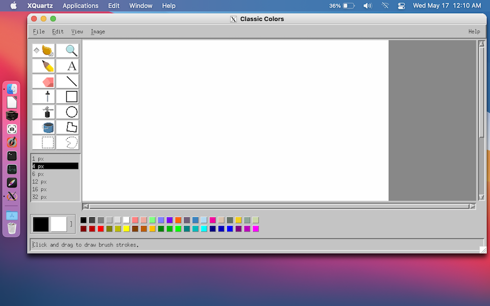

# Classic Colors 

Classic Colors is a simple and efficient paint program for Unix systems, inspired by MS Paint (Windows 95-98 version).
It is built on the time-tested [Motif][about-motif] UI library, so it should last for a long time
and be widely compatible with various Unix flavours (Leagcy unix (and such compatable) systems may not be tested as they may be absurdly rare -e,g. IRIX, HP-UX, AIX, OpenVMS, NeXTSTEP, SCO UNIX, Domain/OS SysV & BSD layers, etc.).

[about-motif]:  https://en.wikipedia.org/wiki/Motif_(software)

## Dependencies

For now, you must build from source (help making it available in package managers would be greatly appreciated.)  
It has been tested on Debian (Ubuntu, Raspbian/RaspberryPi-OS), OpenBSD, NetBSD, and macOS(Homebrew + Pkgsrc).

**List**

- gnumake
- X11 (XQuartz on mac)
- [Motif](https://motif.ics.com/motif) (dev version)
- Xt
- Xpm
- Xp (only if motif on your platform is built with print support)
- pkg-config (usually comes with package manager)

**Debian/Ubuntu**:

	sudo apt install libmotif-dev libxpm-dev libxext-dev

**Fedora/RedHat/CentOS/(and the like…)***

	sudo yum

**Suse**

    yapper 

**macOS (homebrew)**:

Install [XQuartz][xquartz] either from the link, or homebrew cask:

	brew install xquartz

If you just installed XQuartz for the first time make sure you restart otherwise you will get an error:

	Error: Can't open display.

Now install motif:

	brew install openmotif libxpm

[xquartz]: https://www.xquartz.org/

**NetBSD (pkgsrc)**

	pkgin install motif gmake pkg-config

**OpenBSD**

	pkg_add motif gmake

**FreeBSD**

	pkg

**openIndiana/Tribblix**:

Classic colors is available as a package for [Tribblix](http://www.tribblix.org/zap.html):

    zap install-overlay classic-colors

As for OpenIndina (ISP):
	
	pkg

    
## Install

Now you are ready to build:

	./configure
	make
	make install
    
And run:

	classic-colors

If you do not want to install in your path, the build output `./bin/classic-colors`
is a standalone executable(with some limitions) which can be moved around.

## Platform notes

Classic colors uses the [MIT SHM][shm] extension when available.
This extension allows the display to refresh much faster.
There is a fallback codepath when it is not available.
It works well, it's just not as smooth (or as fast).

SHM can be disabled at configuration time:

	./configure --no-shm

Unfortunatly, macOS does not allow very much SYSV shared memory to be used,
and so it is likely if you resize the window very large it will exceed this limit and switch to the fallback codepath.
For the best experience on macOS you will need to increase this limit.
Create a file `/etc/sysctl.conf` containing the following:

    kern.sysv.shmmax=134217728
    kern.sysv.shmmin=1
    kern.sysv.shmmni=1024
    kern.sysv.shmseg=256
    kern.sysv.shmall=32768

Please note that you will have to use "Sudo" when creating `sysctl.conf` as `/etc` is an system protected file. An easy way is to create the file with the above contents then:
`sudo mv sysctl.conf /etc` to move it to the "etc" directory. And if you update or upgrade MacOS, you will have to put it back after the update (again with "sudo").

Restart the system after making this change.

[shm]: https://www.x.org/releases/X11R7.7/doc/xextproto/shm.html

### Building Motif

If motif is not available in a package you will need to build it manually.

Download source (De-facto main fork):

	curl -L https://sourceforge.net/projects/motif/files/Motif%202.3.8%20Source%20Code/motif-2.3.8.tar.gz -O

Here the development dependencies on Debian:

	sudo apt install libx11-dev libxt-dev libxext-dev libxft-dev bison flex

## LICENSE

[GPL](LICENSE.txt)

## Screenshots

