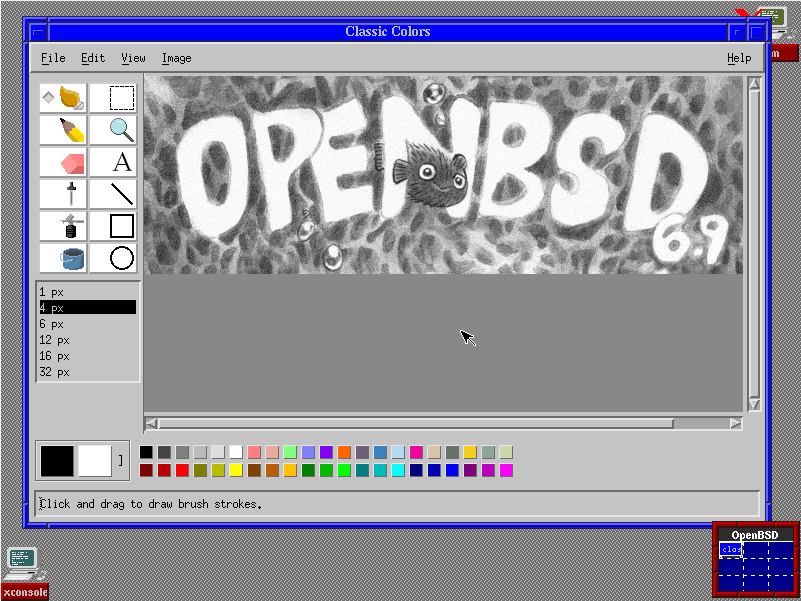

# Classic Colors 

Classic Colors is a simple and efficient paint program for Unix systems, inspired by MS Paint (Windows 95-98 version).
It is built on the time-tested [Motif][about-motif] UI library, so it should last for a long time
and be widely compatible with various Unix flavours.

[about-motif]:  https://en.wikipedia.org/wiki/Motif_(software)

## Dependencies

For now, you must build from source (help making it available in package managers would be greatly appreciated.)  
It has been tested on Debian (Ubuntu), OpenBSD, and macOS(Homebrew).

**List**

- gnumake
- X11 (XQuartz on mac)
- [Motif](https://motif.ics.com/motif) (dev version)
- Xt
- Xpm
- Xp (only if motif on your platform is built with print support)

**Debian/Ubuntu**:

	sudo apt install libmotif-dev libxpm-dev

**OpenBSD**

	pkg_add motif gmake

**Mac (homebrew)**:

Install [XQuartz][xquartz] either from the link, or homebrew cask:

	brew install xquartz

If you just installed XQuartz for the first time make sure you restart otherwise you will get an error:

	Error: Can't open display.

Now install motif:

	brew install openmotif libxpm

**pkgsrc**

	sudo pkgin install motif

[xquartz]: https://www.xquartz.org/

## Install

Now you are ready to build:

	./configure
	make
	make install
    
And run:

	classic-colors

If you do not want to install in your path, the build output `./bin/classic-colors`
is a standalone executable which can be moved around.

## Platform notes

Classic colors uses the [MIT SHM][shm] extension when available.
This extension allows the display to refresh much faster.
There is a fallback codepath when it is not available.
It works well, it's just not as smooth.

SHM can be disabled at configuration time:

	./configure --no-shm

Unfortunatly, macOS does not allow very much SYSV shared memory to be used,
and so it is likely if you resize the window very large it will exceed this limit and switch to the fallback codepath.
For the best experience on macOS you will need to increase this limit.

[shm]: https://www.x.org/releases/X11R7.7/doc/xextproto/shm.html

### Building Motif

If motif is not available in a package you will need to build it manually.

Download source:

	curl -L https://sourceforge.net/projects/motif/files/Motif%202.3.8%20Source%20Code/motif-2.3.8.tar.gz -O

Here the development dependencies on Debian:

	sudo apt install libx11-dev libxt-dev libxext-dev libxft-dev bison flex

## LICENSE

[GPL](LICENSE.txt)

## Screenshots

